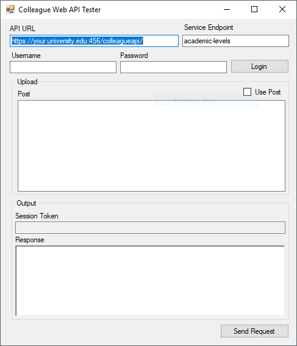

# Colleague Web API Tester

This is a testing client for the Colleague Web API. I did some development using the web api
and this tool was helpful. Now I would probably use Postman or the REST scripting built into
the Jetbrains IDE's.

Given that there are better options out there, I probably won't make anymore changes.

